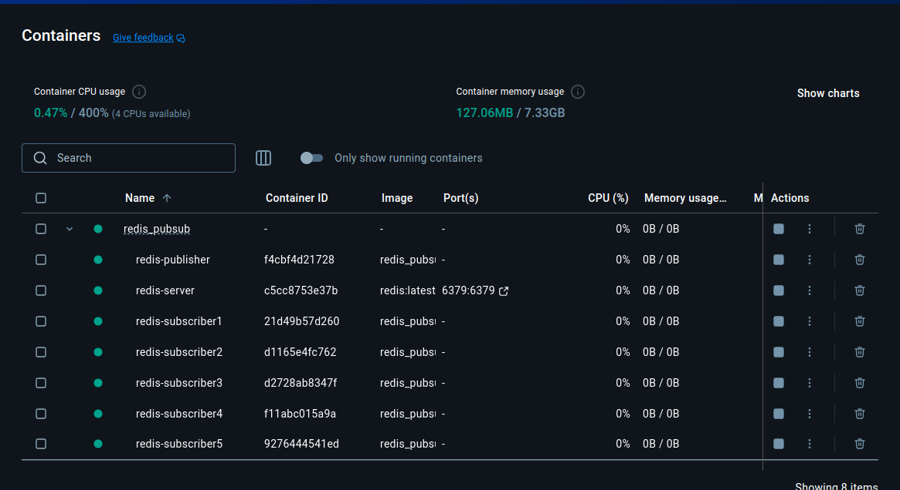

# Redis Docker Setup and Usage

1 Publisher and 5 subcriber Pub/sub Redis

### Running Redis Container

```bash
# Start All Publishers and Subscribers via docker
docker compose up -d --build
```

## Requirements

- Docker
- Python
- Redis-py package (`pip install redis`)

## Additional Commands

```bash
# Stop All container
docker compose down
```

## Notes

- Default Redis port is 6379
- No authentication is set by default
- Data is not persisted by default

## Outputs

Output: redis-server

```python
2025-02-06 18:09:18 1:C 06 Feb 2025 15:09:18.107 * oO0OoO0OoO0Oo Redis is starting oO0OoO0OoO0Oo
2025-02-06 18:09:18 1:C 06 Feb 2025 15:09:18.107 * Redis version=7.4.2, bits=64, commit=00000000, modified=0, pid=1, just started
2025-02-06 18:09:18 1:C 06 Feb 2025 15:09:18.107 # Warning: no config file specified, using the default config. In order to specify a config file use redis-server /path/to/redis.conf
2025-02-06 18:09:18 1:M 06 Feb 2025 15:09:18.108 * monotonic clock: POSIX clock_gettime
2025-02-06 18:09:18 1:M 06 Feb 2025 15:09:18.109 * Running mode=standalone, port=6379.
2025-02-06 18:09:18 1:M 06 Feb 2025 15:09:18.109 * Server initialized
2025-02-06 18:09:18 1:M 06 Feb 2025 15:09:18.109 * Ready to accept connections tcp
2025-02-06 18:09:59 1:signal-handler (1738854599) Received SIGTERM scheduling shutdown...
2025-02-06 18:09:59 1:M 06 Feb 2025 15:09:59.405 * User requested shutdown...
2025-02-06 18:09:59 1:M 06 Feb 2025 15:09:59.405 * Saving the final RDB snapshot before exiting.
2025-02-06 18:09:59 1:M 06 Feb 2025 15:09:59.410 * DB saved on disk
2025-02-06 18:09:59 1:M 06 Feb 2025 15:09:59.410 # Redis is now ready to exit, bye bye...
```

Output: redis-publisher

```python
2025-02-06 18:15:48 Publisher: Publisher:[broker]-543f79fb-022c-485f-adff-f25676575e86
2025-02-06 18:15:48 Message Published :
2025-02-06 18:15:48
2025-02-06 18:15:48 { 'data': 'Test Message 1738854948.8651235',
2025-02-06 18:15:48   'date': '2025-02-06T15:15:48.865158',
2025-02-06 18:15:48   'from_publisher': 'Publisher:[broker]-543f79fb-022c-485f-adff-f25676575e86',
2025-02-06 18:15:48   'timestamp': 1738854948.8651547,
2025-02-06 18:15:48   'uu_id': 'cfe7e87a-3fab-471e-878f-f28d7e657806'}
2025-02-06 18:15:53 Publisher: Publisher:[broker]-543f79fb-022c-485f-adff-f25676575e86
2025-02-06 18:15:53 Message Published :
2025-02-06 18:15:53
2025-02-06 18:15:53 { 'data': 'Test Message 1738854953.883851',
2025-02-06 18:15:53   'date': '2025-02-06T15:15:53.883940',
2025-02-06 18:15:53   'from_publisher': 'Publisher:[broker]-543f79fb-022c-485f-adff-f25676575e86',
2025-02-06 18:15:53   'timestamp': 1738854953.8839371,
2025-02-06 18:15:53   'uu_id': '0208d373-4af2-40b5-bf80-312106ad2dcb'}
2025-02-06 18:15:58 Publisher: Publisher:[broker]-543f79fb-022c-485f-adff-f25676575e86
2025-02-06 18:15:58 Message Published :
2025-02-06 18:15:58
2025-02-06 18:15:58 { 'data': 'Test Message 1738854958.8908436',
2025-02-06 18:15:58   'date': '2025-02-06T15:15:58.890936',
2025-02-06 18:15:58   'from_publisher': 'Publisher:[broker]-543f79fb-022c-485f-adff-f25676575e86',
2025-02-06 18:15:58   'timestamp': 1738854958.8909333,
2025-02-06 18:15:58   'uu_id': '2af8b791-1e9c-4458-a50e-aca4cb68eff5'}
2025-02-06 18:16:03 Publisher: Publisher:[broker]-543f79fb-022c-485f-adff-f25676575e86
2025-02-06 18:16:03 Message Published :
2025-02-06 18:16:03
2025-02-06 18:16:03 { 'data': 'Test Message 1738854963.8920147',
2025-02-06 18:16:03   'date': '2025-02-06T15:16:03.892132',
2025-02-06 18:16:03   'from_publisher': 'Publisher:[broker]-543f79fb-022c-485f-adff-f25676575e86',
2025-02-06 18:16:03   'timestamp': 1738854963.892129,
2025-02-06 18:16:03   'uu_id': '2392f386-e404-46f3-80e2-8b2f252f4c05'}
2025-02-06 18:16:08 Publisher: Publisher:[broker]-543f79fb-022c-485f-adff-f25676575e86
2025-02-06 18:16:08 Message Published :
2025-02-06 18:16:08
2025-02-06 18:16:08 { 'data': 'Test Message 1738854968.8988295',
2025-02-06 18:16:08   'date': '2025-02-06T15:16:08.898916',
2025-02-06 18:16:08   'from_publisher': 'Publisher:[broker]-543f79fb-022c-485f-adff-f25676575e86',
2025-02-06 18:16:08   'timestamp': 1738854968.8989136,
2025-02-06 18:16:08   'uu_id': 'c717c7f6-8085-4ae5-be05-dcb1896af30e'}
2025-02-06 18:16:13 Publisher: Publisher:[broker]-543f79fb-022c-485f-adff-f25676575e86
2025-02-06 18:16:13 Message Published :
2025-02-06 18:16:13
2025-02-06 18:16:13 { 'data': 'Test Message 1738854973.9048657',
2025-02-06 18:16:13   'date': '2025-02-06T15:16:13.904978',
2025-02-06 18:16:13   'from_publisher': 'Publisher:[broker]-543f79fb-022c-485f-adff-f25676575e86',
2025-02-06 18:16:13   'timestamp': 1738854973.904975,
2025-02-06 18:16:13   'uu_id': 'cf5bff70-7077-4728-9326-04d5f309aa43'}
```

Output: redis-subscriber1

```python
2025-02-06 18:15:48 Subscribed to broker...
2025-02-06 18:15:48 Subscribed ID: Subscriber:[broker]-ee28e254-c12c-42f3-bc59-26f7e6c59b45
2025-02-06 18:15:48
2025-02-06 18:15:48 Message Received :
2025-02-06 18:15:48
2025-02-06 18:15:53 Message Received:
2025-02-06 18:15:53
2025-02-06 18:15:53 { 'channel': 'broker',
2025-02-06 18:15:53   'data': '{"name": "Publisher:[broker]-543f79fb-022c-485f-adff-f25676575e86", '
2025-02-06 18:15:53           '"data": {"uu_id": "0208d373-4af2-40b5-bf80-312106ad2dcb", "data": '
2025-02-06 18:15:53           '"Test Message 1738854953.883851", "from_publisher": '
2025-02-06 18:15:53           '"Publisher:[broker]-543f79fb-022c-485f-adff-f25676575e86", '
2025-02-06 18:15:53           '"timestamp": 1738854953.8839371, "date": '
2025-02-06 18:15:53           '"2025-02-06T15:15:53.883940"}}',
2025-02-06 18:15:53   'pattern': None,
2025-02-06 18:15:53   'type': 'message'}
2025-02-06 18:15:58 Message Received:
2025-02-06 18:15:58
2025-02-06 18:15:58 { 'channel': 'broker',
2025-02-06 18:15:58   'data': '{"name": "Publisher:[broker]-543f79fb-022c-485f-adff-f25676575e86", '
2025-02-06 18:15:58           '"data": {"uu_id": "2af8b791-1e9c-4458-a50e-aca4cb68eff5", "data": '
2025-02-06 18:15:58           '"Test Message 1738854958.8908436", "from_publisher": '
2025-02-06 18:15:58           '"Publisher:[broker]-543f79fb-022c-485f-adff-f25676575e86", '
2025-02-06 18:15:58           '"timestamp": 1738854958.8909333, "date": '
2025-02-06 18:15:58           '"2025-02-06T15:15:58.890936"}}',
2025-02-06 18:15:58   'pattern': None,
2025-02-06 18:15:58   'type': 'message'}
2025-02-06 18:16:03 Message Received:
2025-02-06 18:16:03
2025-02-06 18:16:03 { 'channel': 'broker',
2025-02-06 18:16:03   'data': '{"name": "Publisher:[broker]-543f79fb-022c-485f-adff-f25676575e86", '
2025-02-06 18:16:03           '"data": {"uu_id": "2392f386-e404-46f3-80e2-8b2f252f4c05", "data": '
2025-02-06 18:16:03           '"Test Message 1738854963.8920147", "from_publisher": '
2025-02-06 18:16:03           '"Publisher:[broker]-543f79fb-022c-485f-adff-f25676575e86", '
2025-02-06 18:16:03           '"timestamp": 1738854963.892129, "date": '
2025-02-06 18:16:03           '"2025-02-06T15:16:03.892132"}}',
2025-02-06 18:16:03   'pattern': None,
2025-02-06 18:16:03   'type': 'message'}
2025-02-06 18:16:08 Message Received:
2025-02-06 18:16:08
2025-02-06 18:16:08 { 'channel': 'broker',
2025-02-06 18:16:08   'data': '{"name": "Publisher:[broker]-543f79fb-022c-485f-adff-f25676575e86", '
2025-02-06 18:16:08           '"data": {"uu_id": "c717c7f6-8085-4ae5-be05-dcb1896af30e", "data": '
2025-02-06 18:16:08           '"Test Message 1738854968.8988295", "from_publisher": '
2025-02-06 18:16:08           '"Publisher:[broker]-543f79fb-022c-485f-adff-f25676575e86", '
2025-02-06 18:16:08           '"timestamp": 1738854968.8989136, "date": '
2025-02-06 18:16:08           '"2025-02-06T15:16:08.898916"}}',
2025-02-06 18:16:08   'pattern': None,
2025-02-06 18:16:08   'type': 'message'}
2025-02-06 18:16:13 Message Received:
2025-02-06 18:16:13
2025-02-06 18:16:13 { 'channel': 'broker',
2025-02-06 18:16:13   'data': '{"name": "Publisher:[broker]-543f79fb-022c-485f-adff-f25676575e86", '
2025-02-06 18:16:13           '"data": {"uu_id": "cf5bff70-7077-4728-9326-04d5f309aa43", "data": '
2025-02-06 18:16:13           '"Test Message 1738854973.9048657", "from_publisher": '
2025-02-06 18:16:13           '"Publisher:[broker]-543f79fb-022c-485f-adff-f25676575e86", '
2025-02-06 18:16:13           '"timestamp": 1738854973.904975, "date": '
2025-02-06 18:16:13           '"2025-02-06T15:16:13.904978"}}',
2025-02-06 18:16:13   'pattern': None,
2025-02-06 18:16:13   'type': 'message'}
2025-02-06 18:16:18 Message Received:
2025-02-06 18:16:18
2025-02-06 18:16:18 { 'channel': 'broker',
2025-02-06 18:16:18   'data': '{"name": "Publisher:[broker]-543f79fb-022c-485f-adff-f25676575e86", '
2025-02-06 18:16:18           '"data": {"uu_id": "5ee3e75d-d385-41dd-abd3-0b236ade54fe", "data": '
2025-02-06 18:16:18           '"Test Message 1738854978.912323", "from_publisher": '
2025-02-06 18:16:18           '"Publisher:[broker]-543f79fb-022c-485f-adff-f25676575e86", '
2025-02-06 18:16:18           '"timestamp": 1738854978.912418, "date": '
2025-02-06 18:16:18           '"2025-02-06T15:16:18.912421"}}',
2025-02-06 18:16:18   'pattern': None,
2025-02-06 18:16:18   'type': 'message'}
```

Output: redis-subscriber2

```python
2025-02-06 18:15:48 Subscribed to broker...
2025-02-06 18:15:48 Subscribed ID: Subscriber:[broker]-621d6961-bc4b-426c-b9f3-00b2f577f16f
2025-02-06 18:15:48
2025-02-06 18:15:48 Message Received :
2025-02-06 18:15:48
2025-02-06 18:15:48 Message Received:
2025-02-06 18:15:48
2025-02-06 18:15:48 { 'channel': 'broker',
2025-02-06 18:15:48   'data': '{"name": "Publisher:[broker]-543f79fb-022c-485f-adff-f25676575e86", '
2025-02-06 18:15:48           '"data": {"uu_id": "cfe7e87a-3fab-471e-878f-f28d7e657806", "data": '
2025-02-06 18:15:48           '"Test Message 1738854948.8651235", "from_publisher": '
2025-02-06 18:15:48           '"Publisher:[broker]-543f79fb-022c-485f-adff-f25676575e86", '
2025-02-06 18:15:48           '"timestamp": 1738854948.8651547, "date": '
2025-02-06 18:15:48           '"2025-02-06T15:15:48.865158"}}',
2025-02-06 18:15:48   'pattern': None,
2025-02-06 18:15:48   'type': 'message'}
2025-02-06 18:15:53 Message Received:
2025-02-06 18:15:53
2025-02-06 18:15:53 { 'channel': 'broker',
2025-02-06 18:15:53   'data': '{"name": "Publisher:[broker]-543f79fb-022c-485f-adff-f25676575e86", '
2025-02-06 18:15:53           '"data": {"uu_id": "0208d373-4af2-40b5-bf80-312106ad2dcb", "data": '
2025-02-06 18:15:53           '"Test Message 1738854953.883851", "from_publisher": '
2025-02-06 18:15:53           '"Publisher:[broker]-543f79fb-022c-485f-adff-f25676575e86", '
2025-02-06 18:15:53           '"timestamp": 1738854953.8839371, "date": '
2025-02-06 18:15:53           '"2025-02-06T15:15:53.883940"}}',
2025-02-06 18:15:53   'pattern': None,
2025-02-06 18:15:53   'type': 'message'}
2025-02-06 18:15:58 Message Received:
2025-02-06 18:15:58
2025-02-06 18:15:58 { 'channel': 'broker',
2025-02-06 18:15:58   'data': '{"name": "Publisher:[broker]-543f79fb-022c-485f-adff-f25676575e86", '
2025-02-06 18:15:58           '"data": {"uu_id": "2af8b791-1e9c-4458-a50e-aca4cb68eff5", "data": '
2025-02-06 18:15:58           '"Test Message 1738854958.8908436", "from_publisher": '
2025-02-06 18:15:58           '"Publisher:[broker]-543f79fb-022c-485f-adff-f25676575e86", '
2025-02-06 18:15:58           '"timestamp": 1738854958.8909333, "date": '
2025-02-06 18:15:58           '"2025-02-06T15:15:58.890936"}}',
2025-02-06 18:15:58   'pattern': None,
2025-02-06 18:15:58   'type': 'message'}
2025-02-06 18:16:03 Message Received:
2025-02-06 18:16:03
2025-02-06 18:16:03 { 'channel': 'broker',
2025-02-06 18:16:03   'data': '{"name": "Publisher:[broker]-543f79fb-022c-485f-adff-f25676575e86", '
2025-02-06 18:16:03           '"data": {"uu_id": "2392f386-e404-46f3-80e2-8b2f252f4c05", "data": '
2025-02-06 18:16:03           '"Test Message 1738854963.8920147", "from_publisher": '
2025-02-06 18:16:03           '"Publisher:[broker]-543f79fb-022c-485f-adff-f25676575e86", '
2025-02-06 18:16:03           '"timestamp": 1738854963.892129, "date": '
2025-02-06 18:16:03           '"2025-02-06T15:16:03.892132"}}',
2025-02-06 18:16:03   'pattern': None,
2025-02-06 18:16:03   'type': 'message'}
2025-02-06 18:16:08 Message Received:
2025-02-06 18:16:08
2025-02-06 18:16:08 { 'channel': 'broker',
2025-02-06 18:16:08   'data': '{"name": "Publisher:[broker]-543f79fb-022c-485f-adff-f25676575e86", '
2025-02-06 18:16:08           '"data": {"uu_id": "c717c7f6-8085-4ae5-be05-dcb1896af30e", "data": '
2025-02-06 18:16:08           '"Test Message 1738854968.8988295", "from_publisher": '
2025-02-06 18:16:08           '"Publisher:[broker]-543f79fb-022c-485f-adff-f25676575e86", '
2025-02-06 18:16:08           '"timestamp": 1738854968.8989136, "date": '
2025-02-06 18:16:08           '"2025-02-06T15:16:08.898916"}}',
2025-02-06 18:16:08   'pattern': None,
2025-02-06 18:16:08   'type': 'message'}
2025-02-06 18:16:13 Message Received:
2025-02-06 18:16:13
2025-02-06 18:16:13 { 'channel': 'broker',
2025-02-06 18:16:13   'data': '{"name": "Publisher:[broker]-543f79fb-022c-485f-adff-f25676575e86", '
2025-02-06 18:16:13           '"data": {"uu_id": "cf5bff70-7077-4728-9326-04d5f309aa43", "data": '
2025-02-06 18:16:13           '"Test Message 1738854973.9048657", "from_publisher": '
2025-02-06 18:16:13           '"Publisher:[broker]-543f79fb-022c-485f-adff-f25676575e86", '
2025-02-06 18:16:13           '"timestamp": 1738854973.904975, "date": '
2025-02-06 18:16:13           '"2025-02-06T15:16:13.904978"}}',
2025-02-06 18:16:13   'pattern': None,
2025-02-06 18:16:13   'type': 'message'}
2025-02-06 18:16:18 Message Received:
2025-02-06 18:16:18
2025-02-06 18:16:18 { 'channel': 'broker',
2025-02-06 18:16:18   'data': '{"name": "Publisher:[broker]-543f79fb-022c-485f-adff-f25676575e86", '
2025-02-06 18:16:18           '"data": {"uu_id": "5ee3e75d-d385-41dd-abd3-0b236ade54fe", "data": '
2025-02-06 18:16:18           '"Test Message 1738854978.912323", "from_publisher": '
2025-02-06 18:16:18           '"Publisher:[broker]-543f79fb-022c-485f-adff-f25676575e86", '
2025-02-06 18:16:18           '"timestamp": 1738854978.912418, "date": '
2025-02-06 18:16:18           '"2025-02-06T15:16:18.912421"}}',
2025-02-06 18:16:18   'pattern': None,
2025-02-06 18:16:18   'type': 'message'}
```

## Memory Usage


